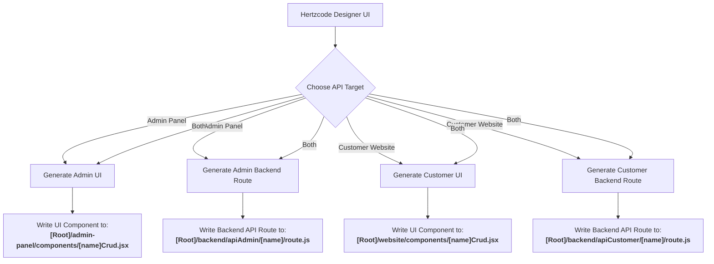

# Proposed Multi-Project Code Generation Structure (Hertzcode)

This document outlines the architectural changes and file generation distribution plan for the new code generator. It explains how files are generated and where they will go based on the selected API Target.

---

## 1. Code Generation Flow Chart



---


## 2. Directory Tree Representation
When you choose a root folder for generation (e.g. `c:\Users\Faizan\Desktop\MyEcommerce`), the generator will create the following layout:

```text
[Root Directory / Desktop Folder]
├── backend/
│   ├── package.json               <-- Shared Node.js/Express config
│   ├── server.js                  <-- Shared Express/HTTP server setup
│   ├── config/
│   │   ├── db.js                  <-- Centralized Database Connection (Pool)
│   │   └── common.js              <-- Common helper functions for Customer/Admin
│   ├── apiCustomer/               <-- Customer Website Endpoints
│   │   └── [tableName]/
│   │       └── route.js           <-- Imports DB and common utils
│   └── apiAdmin/                  <-- Admin Portal Endpoints
│       └── [tableName]/
│           └── route.js           <-- Imports DB and common utils
│
├── admin-panel/                   <-- Next.js Admin Panel Project
│   ├── package.json
│   ├── components/                <-- Generated Admin CRUD components
│   │   └── [tableName]Crud.jsx
│   └── app/                       <-- Next.js Pages/Routing
│
└── website/                       <-- Next.js Customer Frontend Project
    ├── package.json
    ├── components/                <-- Generated Customer components/views
    │   └── [tableName]List.jsx
    └── app/                       <-- Next.js Pages/Routing
```

---

## 3. API Target Split Details

We will add an `apiTarget` option to the builder schema which can be one of:
* `"admin"` (Generated inside `admin-panel` and `backend/apiAdmin`)
* `"customer"` (Generated inside `website` and `backend/apiCustomer`)
* `"both"` (Generated inside both sets of projects)

### A. Backend Generation Path (`backend/`)
Instead of a single endpoint, the generator will write backend routes based on the target:
* **Admin APIs**: Generated at `[Root]/backend/apiAdmin/[tableName]/route.js`
* **Customer APIs**: Generated at `[Root]/backend/apiCustomer/[tableName]/route.js`

### B. Frontend Generation Path (`admin-panel/` and `website/`)
* **Admin UI (Management Screen)**: Written to `[Root]/admin-panel/components/[tableName]Crud.jsx`. This component handles Full CRUD operations (Add, Edit, List, Delete) and points calls to `/api/apiAdmin/[tableName]`.
* **Customer UI (Consumer Screen)**: Written to `[Root]/website/components/[tableName]View.jsx` or `[tableName]List.jsx`. This component handles read-only or transactional actions (e.g. Add-to-cart, View lists) and calls `/api/apiCustomer/[tableName]`.

---

## 4. Step-by-Step Implementation Roadmap

Here are the major changes we will make to implementation:

### Step 1: Update Schema Builder UI
Add an "API Target" field in the Builder UI. This dropdown will allow selecting:
* **Admin Panel (Default)**
* **Customer Website**
* **Both (Shared)**

### Step 2: Revamp `crudController.js` logic
1. Parse the new `apiTarget` parameter from `req.body.file.settings.apiTarget`.
2. Construct target directories:
   * `[Root]/backend/apiAdmin`
   * `[Root]/backend/apiCustomer`
   * `[Root]/admin-panel/components`
   * `[Root]/website/components`
3. Execute conditional file writes:
   * Write to admin paths if target is `"admin"` or `"both"`.
   * Write to customer paths if target is `"customer"` or `"both"`.

### Step 3: Boilerplate Initializer (Optional / Recommended)
If the sub-folders like `admin-panel`, `website`, or `backend` are empty or do not exist, Hertzcode will write a basic template:
1. **`backend/config/db.js`**: Centralized MySQL connection pool setup so individual routes import the DB client from here instead of recreating connections.
2. **`backend/config/common.js`**: Shared helper functions (validation, formatters) used by both customer and admin APIs.
3. **`package.json` / `server.js`**: Set up a generic server wrapper that starts the backend app and handles CORS/routing.
4. **Next.js config**: Basic template setup for the admin-panel and website applications.

